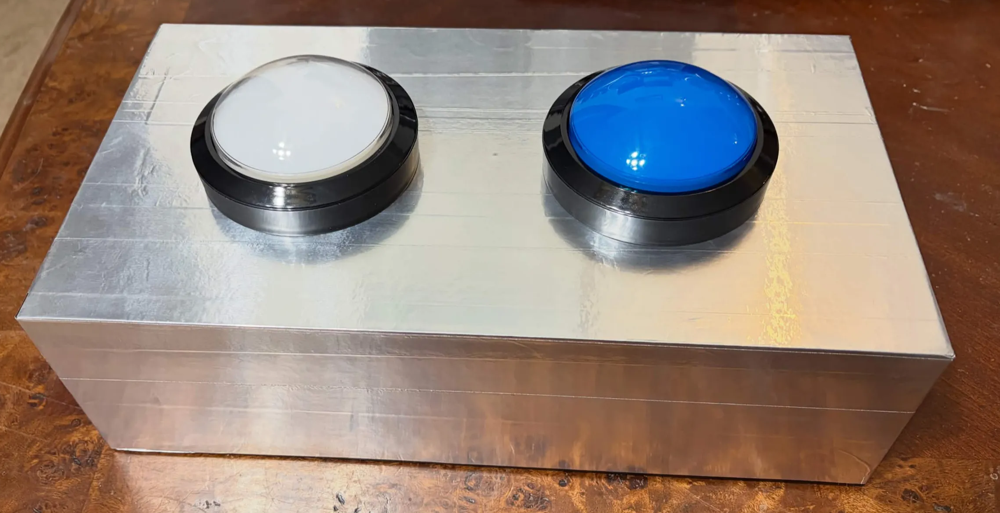
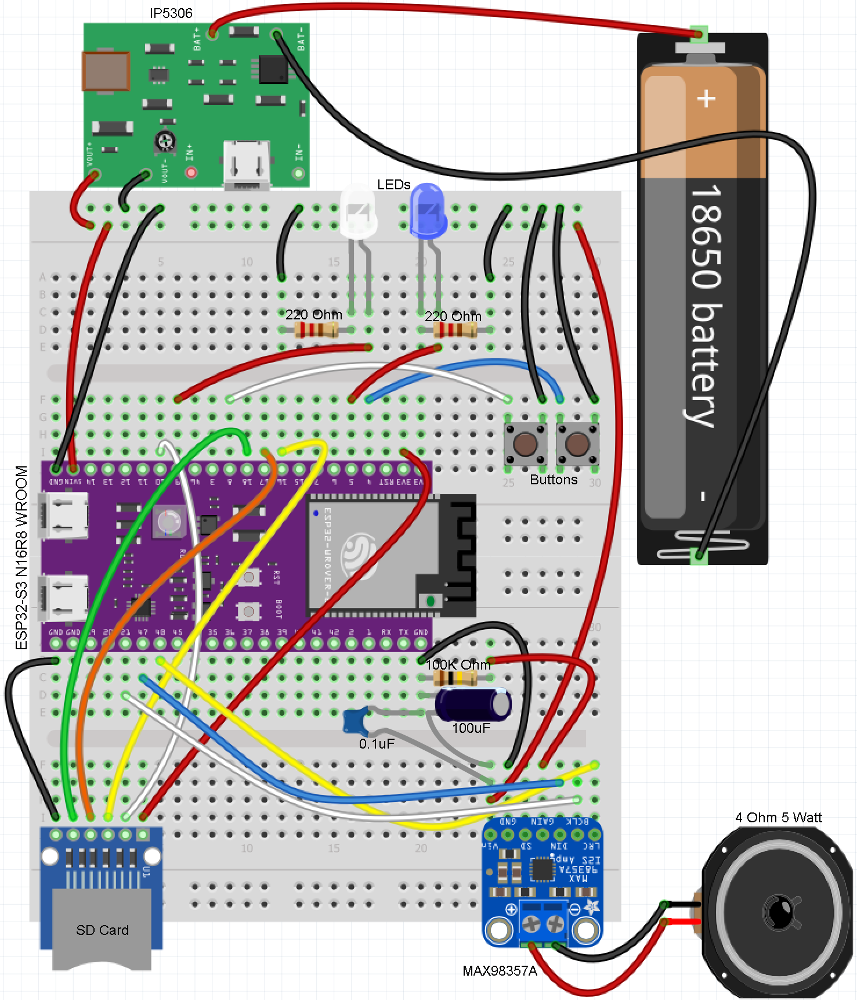
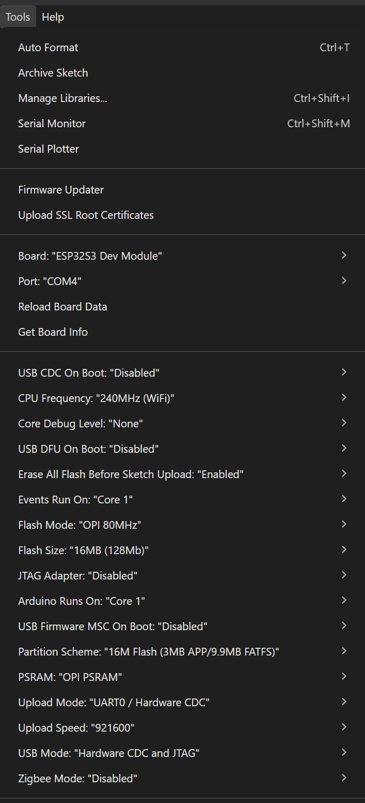
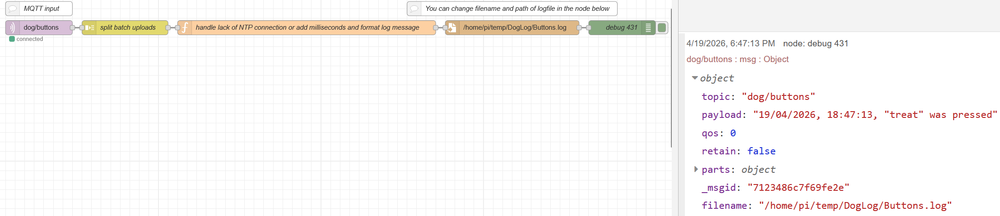

# DIY Dog Buttons
A fully custom, WiFi-enabled dog communication button system built on an ESP32-S3.

This project is inspired by commercial dog communication buttons, but built from scratch with full control, expandability, and MQTT data logging.

Train your dog to “talk” using buttons while collecting real usage data for analysis, automation, or just curiosity.

### Prototype demo
[](https://www.youtube.com/watch?v=20AYtqZYDEI)

### Dog using buttons
[](https://www.youtube.com/watch?v=1tW9sytlCj8)

For training tips to teach your dog to use them, visit my [youtube channel](https://www.youtube.com/@TheBanndit)

## Description
This project allows your dog to press physical buttons that:

Play recorded audio of your voice (e.g., “treat”, “outside”)

Provide LED feedback in buttons during playback

Log button presses with timestamps via MQTT to a local Node-RED server

### It is ideal for:

Dog training and communication research

Smart home integration

IoT experimentation with ESP32-S3

Learning embedded systems, MQTT, RTOS, and Node-RED

## Software
[Arduino IDE](https://www.arduino.cc/en/software/): for uploading to ESP32

[ESP32-audioI2S Library](https://github.com/schreibfaul1/ESP32-audioI2S): for playing audio files from SD card via I2S on an ESP32

[Audacity](https://www.audacityteam.org/download/): for recording audio files

[Node-RED](https://nodered.org/docs/getting-started/raspberrypi): for data logging and further analytics/integrations

[Mosquitto MQTT Broker](https://mosquitto.org/download/): for MQTT messaging between devices

## Hardware
ESP32-S3 N16R8 WROOM - https://www.amazon.com/dp/B0D93DLB6Q ⚠️ ESP32 Model must have PSRAM ⚠️

Micro SD Card Module - https://www.amazon.com/dp/B0FSWXYBYH

8GB Micro SD Card (FAT32) - https://www.amazon.com/dp/B0D5HDNMP8

MAX98357A I2S Amplifier - https://www.amazon.com/dp/B0B4GK5R1R

4 Ohm 5 Watt Speaker - https://www.amazon.com/dp/B081169PC5

IP5306 Lithium Battery Boost and Charge Module - https://www.amazon.com/dp/B0836J8LR4

18650 Battery Cell - Salvage from laptop and tool batteries or https://www.amazon.com/dp/B0G4VY3HT6

Battery Holder - https://www.amazon.com/dp/B0BJV7SK5D

4-Inch Buttons with LED - https://www.amazon.com/dp/B071FSKY6Q

### Optional Hardware:
Micro USB Power Adapter (for charging 18650 cells easier) - https://www.amazon.com/dp/B0G4VY3HT6

Breadboard + Male to Male Dupont wires (for prototyping) - https://www.amazon.com/dp/B08Y59P6D1

0.1uF ceramic and 100uF electrolytic capacitors (bypass capacitors for amp sound quality) - Just find some cheap ones it's not rocket science

Raspberry Pi Zero 2 W (to host a [Node-RED](https://nodered.org/docs/getting-started/raspberrypi) server and [MQTT Broker](https://mosquitto.org/download/) for logging data) - https://www.amazon.com/dp/B0DRRRZBMP this kit does not come with power adaptor

## Installation

Included is a `Dog_Buttons.ino` file that needs to be uploaded to your ESP32 using the [Arduino IDE](https://www.arduino.cc/en/software/) (check images below for settings). There are also two example audio files `treat.wav` and `outside.wav` that need to be loaded onto the root `/` directory of the Micro SD Card.

⚠️ IMPORTANT: You will need to install the [ESP32-audioI2S Library](https://github.com/schreibfaul1/ESP32-audioI2S) into your Arduino IDE for the sketch to function correctly. You can either clone it into your Arduino Libraries folder or just download it as a ZIP file. If you grab the ZIP file, you can add it to your Arduino IDE using the Add ZIP Library item on the Sketch menu. And if you haven't worked with ESP32 boards in Arduino IDE yet, you'll need to follow this [tutorial](https://randomnerdtutorials.com/installing-the-esp32-board-in-arduino-ide-windows-instructions/) to install the ESP32 Add-on for them to work. 

## Node-RED and Mosquitto MQTT Broker
Is a low-code programming platform built on JavaScript that makes it easy for beginners and professionals alike to rapidly prototype their ideas into fully functional projects with a focus on event driven applications.

You can [host a local Node-RED server using a Raspberry Pi](https://nodered.org/docs/getting-started/raspberrypi) (I used a Zero 2 W) and host a [Mosquitto MQTT Broker](https://mosquitto.org/download/) to log data from an ESP32 to track patterns and behavior trends over time, visualize button usage, and trigger smarthome automations.

### The commands to install Node-RED are:

```bash
# Installation script
bash <(curl -sL https://github.com/node-red/linux-installers/releases/latest/download/update-nodejs-and-nodered-deb)

# If you want Node-RED to run when the device is turned on, or re-booted, you can enable the service to autostart by running
sudo systemctl enable nodered.service
```

Once Node-RED is running you can access the editor in a browser.

If you are using the browser on the Pi desktop, you can open the address: http://localhost:1880

If you are using another devices browser replace localhost with the IP address of your Raspberry Pi running Node-RED. You can find the IP address by running `hostname -I` on the Pi.

### The commands to install Mosquitto are:

```bash
# Installation script
sudo apt install -y mosquitto mosquitto-clients

# Run as a service at start
sudo systemctl enable mosquitto.service

# Test the installation
mosquitto -v

# By default connections will only be possible from clients running on this machine, so you will need to enable remote access
# Run the following command to open the mosquitto.conf file
sudo nano /etc/mosquitto/mosquitto.conf

#Move to the end of the file using the arrow keys and paste the following two lines:
listener 1883
allow_anonymous true
# Then, press CTRL-X to exit and save the file. Press Y and Enter
 
# Restart Mosquitto for the changes to take effect
sudo systemctl restart mosquitto
```
For more detailed instructions on installing and setting up Mosquitto check out this [tutorial](https://randomnerdtutorials.com/how-to-install-mosquitto-broker-on-raspberry-pi/).

[Instructions for Importing and Exporting Flows in Node-RED](https://nodered.org/docs/user-guide/editor/workspace/import-export)

Included is a `flow.json` file that will get you logging data very quickly.

⚠️ NOTE: You will need to configure the MQTT node in the flow to match your [Mosquitto MQTT Broker's](https://mosquitto.org/download/) settings. You can also change the logfile name and path in the flow using the built-in [Node-RED editor](https://nodered.org/docs/user-guide/editor/).

## Wiring Overview
| Component | ESP32 Pin |
| --------- | --------- |
| SD CS     | GPIO 10   |
| SPI MOSI  | GPIO 16   |
| SPI MISO  | GPIO 18   |
| SPI SCK   | GPIO 17   |
| I2S DOUT  | GPIO 21   |
| I2S BCLK  | GPIO 20   |
| I2S LRC   | GPIO 47   |
| Button 1  | GPIO 4    |
| Button 2  | GPIO 8    |
| LED 1     | GPIO 5    |
| LED 2     | GPIO 9    |

If you wire it differently, be sure to update the code with the pins you used.

## Configuration
⚠️ IMPORTANT: Update these values in the code to match your Wi-Fi and [MQTT Broker](https://mosquitto.org/download/) settings:
```cpp
// WiFi
const char* ssid = "SSID";
const char* wifi_password = "PASSWORD";

// MQTT
const char* mqtt_server = "IP_ADDRESS";
const int   mqtt_port = 1883;
const char* mqtt_user = "USERNAME";
const char* mqtt_pass = "PASSWORD";
```

## Audio Setup
Format: `.wav`

Encoding: PCM

Bit depth: 16-bit

Sample rate: 16kHz

Channels: Mono

## MQTT Data Format
```json
[
  {"event":"treat","time":1776649393},
  {"event":"outside","time":1776649430}
]
```

## Log Format
```csv
19/04/2026, 18:47:13, "treat" was pressed
19/04/2026, 18:48:51, "outside" was pressed
```

## Images
### Dog Buttons


### Prototype


### Fritzing Schematic


### Arduino Settings


### Node-RED Flow


## Notes & Tips
If audio is too quiet → normalize files in Audacity

If audio glitches → add bypass capacitors to the amplifier

If MQTT drops → check Wi-Fi stability and broker availability

Uncomment Serial lines in code for debugging

## Contributing
Contributions are welcome! Please feel free to submit a [Pull Request](https://github.com/HaroldPetersInskipp/DIY-Dog-Buttons/pulls).

## License
This project is licensed under the MIT License - see the [LICENSE](LICENSE) file for details.

## Support
If you encounter any issues or have any questions, please [file an issue](https://github.com/HaroldPetersInskipp/DIY-Dog-Buttons/issues/new) on the GitHub repository.
